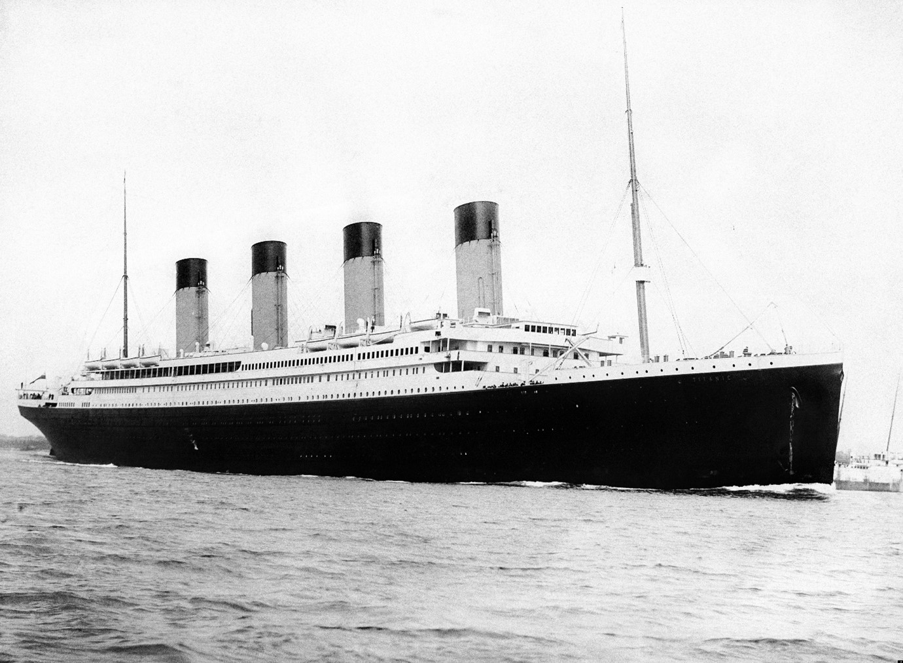

# Exercise - Analyse Titanic Passenger Data

Almost everyone knows the story of the Titanic.  In April 1912, this magnificent ship left Southampton on its maiden voyage to New York but it never arrived.  It hit an iceberg in the Atlantic and sank.  There were over 2,000 people on board.  Less than half survived.

A century later, this Titanic dataset is a classic case study for rookie data scientists to build a predictive model to determine who is likely to survive or perish (ignoring the fact that this is a matter of historical record). However, we will see if an AI tool can help us gain some intuition and who did and did not survive and why.  We know from the film that Kate Winslet survived but poor old Leo DiCaprio did not – is that an accurate reflection?

This dataset contains a list of 891 of the passengers on board including variables (columns) such as Name, Age, Sex, and Pclass i.e. whether they travelled 1st, 2nd or 3rd class. Download the data from [here](./Resources/Titanic%20Passenger%20Data.csv)

Here are some suggested prompts to start your analysis.  The first prompt describes of the columns – this is useful as the variable names are difficult to understand

*Initial Prompt*
Act as an data analyst.  The attached data has a partial list of passengers on the Titanic.  Here is a description of the columns:
* `PassengerId`
* `Survived`, 0 = Died, 1 = Survived
* `Pclass`, Passenger Class
* `Name`
* `Sex`	
* `Age`	
* `SibSp`, Number of siblings (brothers/sisters)  and spouses in the party travelling with the passenger (excluding the passenger)
* `Parch`, Number of parents and children in the party travelling with the passenger (excluding the passenger)
* `Ticket`		
* `Fare`	
* `Cabin`	
* `Embarked`, S = Southampton, Q = Queenstown, C = Cherbourg

*Subsequent prompts*
1. Describe the data
1. Are there any data quality issues in the data?
1. How many passengers were in each passenger class?
1. What percentage of passengers survived?
1. What factors made it more likely that a passenger would survive?
1. Can you provide the results of your analysis in a few charts.