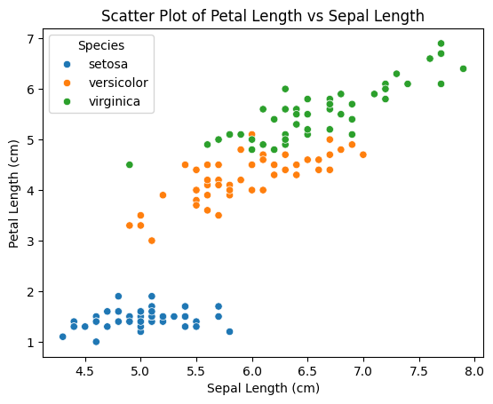

# Use AI Tools to help write Python

AI tools can help us write and learn Python.  For example, we can enter a prompt like this:

_Example Prompt:_
A dataset is at a public location at https://raw.githubusercontent.com/MarkWilcock/CourseDatasets/main/Iris/irisdata.csv
It contains 150 rows with the following columns:
* `Observation`, an integer, unique identifier 
* `Sepal Length`, measured in cm
* `Sepal Width`,  measured in cm
* `Petal Length`,  measured in cm
* `Petal Width`,  measured in cm
* `Species` , one of values `setosa`, `versicolor`, `virginica`

Write the Python code to import this file, and create a scatter plot of Petal Length vs Sepal Length with Species on the legend.  Use the seaborn library for the visualisation.

The AI tool may respond with some Python code like the example below

```python
import pandas as pd
import seaborn as sns
import matplotlib.pyplot as plt

# URL of the dataset
url = "https://raw.githubusercontent.com/MarkWilcock/CourseDatasets/main/Iris/irisdata.csv"

# Import the dataset
df = pd.read_csv(url)

# Display the first few rows of the dataset to verify its contents
print(df.head())

# Create a scatter plot of Petal Length vs Sepal Length with Species on the legend
sns.scatterplot(data=df, x='Sepal Length', y='Petal Length', hue='Species')

# Add title and labels
plt.title('Scatter Plot of Petal Length vs Sepal Length')
plt.xlabel('Sepal Length (cm)')
plt.ylabel('Petal Length (cm)')

# Show the plot
plt.show()
```

This code creates the chart below.  


## Exercise: Create Python data structures

Here are a set of prompts you can use to ask the AI to generate some Python code .  Use these as a starting point.  The prompts are based on coding tasks for students in an exercise about data structures (list, tuple,dicts) in my Python course.

If you have a access to a Python environment, use it to test the code generated by the AI.  If you don't, you can create a Pytnon environment following [these instructions](https://github.com/MarkWilcock/Python-Course/blob/main/Setup%20Python.md) or simply inspect the code generated.

_Prompt:_
Act as a Python expert.  Provide Python code in response to the subsequent prompts and give a brief explanation suitable for beginners to Python.

_Prompt:_
Create a list with at least three elements of string datatype. Choose fruit or flowers or cars or whatever.

1. Find the first element.
1. Find the last element.
1. Append another element to the list
1. Count the elements in the list
1. Insert an element into the third position
1. Sort the list

_Prompt:_
Create a tuple with three elements. Assign each element of the tuple to a different variable.

_Prompt:_
Create a dictionary with these keys and values:

* key "ENG", value "England"
* key "WAL", value "Wales"
* key "SCO", value "Scotland"
* key "NIR", value "Northern Ireland"

_Prompt:_
Answer these questions about this dict

1. What is the value corresponding to the "NIR" key?
1. What is the value corresponding to the "GBR" key?
1. Can you set a key "JER" with value "Jerzee"
1. Can you set another key "JER" with value "Jersey". What happens?

Here is a link to a shared ChatGPT conversation based on this example https://chatgpt.com/share/6e24bb88-dac5-48ef-9978-f4c7460d0929 


##  Exercise: a more challenging Python task

If you are familiar with Python basics, choose a task from one of the more advanced examples in my Python course.  Copy the instrictions in comments or markdown into the prompt box for the AI tool and evaluate and test the response

For example, there are exercises on:
* writing a function https://github.com/MarkWilcock/Python-Course/blob/main/functions_exercise_bmi.ipynb
* invoking an API https://github.com/MarkWilcock/Python-Course/blob/main/api_astronauts_exercise.ipynb 
* cleaning data with pandas https://github.com/MarkWilcock/Python-Course/blob/main/analyse%20data%20with%20pandas/pandas_titanic_exercise.ipynb 
* the numpy package https://github.com/MarkWilcock/Python-Course/blob/main/analyse%20data%20with%20pandas/numpy_exercise.ipynb 
* visualising a dataset with seaborn https://github.com/MarkWilcock/Python-Course/blob/main/visualise%20data%20with%20seaborn/viz_survey.ipynb 


## AI Code Assistants / Pair Programmers 

AI Tools are exceptionally good at helping us understand, learn, and write code.  When these tools are embedded into our code editor, they are known as called code-assistants or pair-programmers.  They help in many ways:
* If we are writing a line of code, they can suggest possible ways we want to complete that line or block of code.
* We can state our intent (what we want to do) in English (other human languages are available possibly to lesser extents) in a comment line and they will write the code below the comment.
* They can review, explain, and add comments to existing code.
* They can improve the code to a better standard and quality.
* If our code has generated an error, they can explain why the error occurred, explain how to fix it and possibly fix it for us.

Examples of code assistants include:
* GitHub Copilot:  Works with popular (free) VSCode editor.  It is popular for Python and SQL.
* Copilot in Microsoft Fabric Python notebooks;
* (In beta currently), an assistant in Google Colab Python notebooks.


